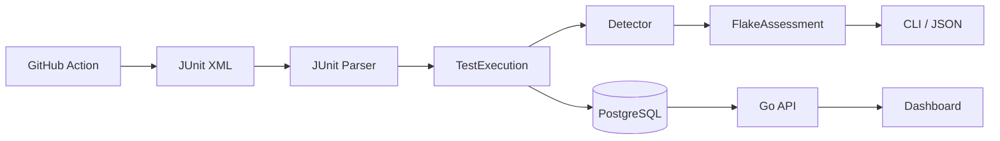

# FlakeHawk Architecture

FlakeHawk separates ingestion, normalization, detection, storage, and presentation.

## Detection signals

### Same-commit disagreement

The same test has both a pass and a failure for one commit SHA. This is strong evidence of nondeterminism, but only when commit metadata is trustworthy.

### Retry-pass

A failed attempt is followed by a successful retry. This is evidence, not proof: transient infrastructure problems can create the same pattern.

### Confidence

The MVP exposes its inputs instead of hiding them behind an opaque ML score. Sample size is incorporated using a Wilson lower bound, with explicit evidence bonuses for retry-pass and same-SHA disagreement.

## Automation policy

Automatic quarantine is not enabled by default. Detection should produce evidence first; any future automation should be policy-driven, reversible, owned, and time-limited.
